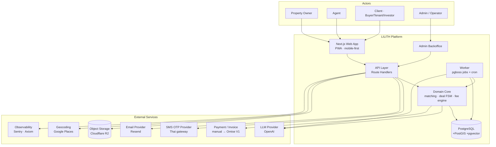
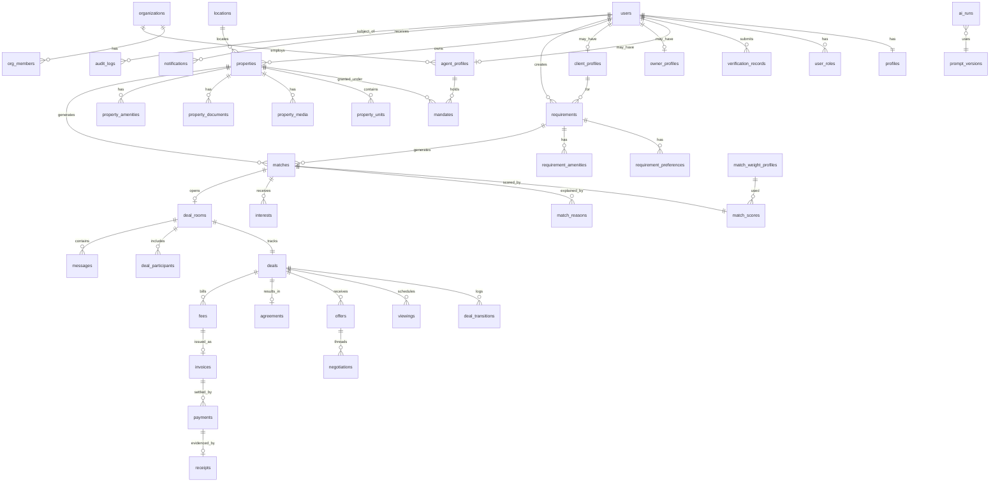

# LILITH by THE MIDDLE — Architecture Blueprint
## Part 1 — Product & System Architecture (Sections 1–8)

> Document status: **Architecture baseline v1.0** — binding contract for implementation.
> Audience: Codex (implementation), Manus (QA), Owner (approval).
> Rule: if code disagrees with this document, the document is fixed first, then the code.

---

# 1. Executive Architecture Summary

## 1.1 What is being built

A **two-sided property matching and deal-execution platform** for the Bangkok market, where:

- **Supply** = properties published by Owners and by Agents holding a mandate.
- **Demand** = requirements created by Clients (buyer / tenant / investor) or by Agents on a client's behalf.
- **Lilith** = a named AI service layer that extracts, normalises, enriches, explains and summarises — but never decides business outcomes.
- **The Middle** = the platform operator, which earns a **success fee of 0.1% of transaction value** on closed deals.

The product is *not* a listing website. It is three layers stacked:

| Layer | What it does | Why it is defensible |
|---|---|---|
| Matching Infrastructure | Deterministic, explainable supply↔demand scoring | Score is reproducible and auditable; weights are data, not code |
| Deal Collaboration | Deal Room, viewings, offers, agreements, timeline | Every transition is permission-checked and audit-logged |
| Property Intelligence | Aggregated supply/demand signal, price reality, absorption | Only possible because matching + deal data is captured structurally |

## 1.2 Ten architectural commitments

1. **Match score is deterministic.** Same inputs → same score, always. LLMs contribute *inputs and explanations*, never the number.
2. **Weights and rules are configuration rows**, versioned in the database. Changing a weight is an admin action, not a deploy.
3. **The deal is a state machine.** No status field is ever written directly; every change goes through a guarded transition that emits a domain event and an audit record.
4. **Authorization is server-side, resource-scoped, on every request.** The frontend never carries authority. Deal Room membership is checked per request against `deal_participants`.
5. **Every AI output that touches business process carries provenance**: `model`, `prompt_version`, `confidence`, `input_ref`, `generated_at`, and a human override path.
6. **PII and documents are never publicly addressable.** Private bucket + short-lived signed URLs + access logged.
7. **Money is modelled explicitly.** `transaction_value`, `fee_basis`, `fee_rate`, `fee_amount` are separate persisted columns with an immutable snapshot of the fee rule that produced them. Amounts are stored in minor units (satang) as `BIGINT`.
8. **Three event streams, not one**: product analytics events, domain events, audit events. They have different retention, different consumers, different guarantees.
9. **Soft delete + row versioning on business-critical entities.** Nothing that participated in a deal is ever hard-deleted while the deal record lives.
10. **No architectural dead ends in the MVP.** Everything runs as one Next.js deployment + one Postgres for MVP, but every seam that will later need to split (matching engine, AI service, event pipeline, media) is already a module boundary with its own interface.

## 1.3 Stack decision (summary; ADRs in Part 5)

```
Frontend        Next.js 15 App Router · TypeScript · React 19 · Tailwind v4 · shadcn/ui (restyled)
Mobile shell    PWA first; Capacitor wrapper only if store presence is required (V2)
Backend         Next.js Route Handlers + a pure-TypeScript domain layer in /packages/core
Database        PostgreSQL 16 (Neon or Supabase Postgres) + PostGIS + pg_trgm + pgvector
ORM             Prisma (schema authority) + raw SQL for the match query and analytics
Auth            Auth.js (NextAuth) credentialless: phone OTP + email magic link; RBAC in DB
Storage         S3-compatible (Cloudflare R2) — private buckets, signed URLs only
Realtime        Postgres LISTEN/NOTIFY → SSE for MVP; managed WS (Ably/Pusher) at V1 if needed
Jobs            Postgres-backed queue (pgboss) — no Redis in MVP
Search          Postgres: GIST/GIN indexes, full-text, trigram. pgvector for semantic assist only
AI              Provider-agnostic `LilithClient` interface; OpenAI default; every call logged to ai_runs
Deploy          Vercel (web) + managed Postgres + R2. Worker on Vercel Cron → Railway/Fly at V1
Analytics       Own `events` table (source of truth) → optional PostHog mirror
```

Nothing else is added to the infrastructure until a named, measured problem requires it.

---

# 2. System Context Diagram



**Trust boundaries**

| Boundary | Rule |
|---|---|
| Browser → API | Zero trust. Session cookie only proves identity, never permission. |
| API → Domain Core | Core functions take an explicit `ActorContext {userId, roles, orgId}`; no ambient auth. |
| Domain Core → LLM | All prompts pass a PII redaction filter; raw contact data never leaves the platform. |
| API → Storage | No public bucket. Every read is a signed URL issued after an authorization check. |
| Admin → everything | Separate role, separate audit stream, elevated actions require reason text. |

---

# 3. User / Actor Architecture

## 3.1 Identity model

One `users` row per human. Roles are **additive capabilities**, not exclusive types — a person can be both an Owner (their own condo) and a Client (looking to buy another).

```
users (identity: phone/email, credentials, status)
  └── profiles (1:1, display identity, locale, avatar)
        ├── owner_profiles     (0..1)
        ├── agent_profiles     (0..1)  → optionally linked to organizations
        └── client_profiles    (0..1)
  └── user_roles (n) → role enum + scope (global | org:<id>)
```

`active_role` is a **UI context switch** stored in the session, never a security decision. Every server check re-derives permission from `user_roles` + resource ownership.

## 3.2 Actor capability matrix

| Capability | OWNER | AGENT | CLIENT | ADMIN |
|---|---|---|---|---|
| Create property | ✅ own | ✅ with mandate record | ❌ | ✅ on behalf (audited) |
| Publish property | ✅ after verification | ✅ after verification + mandate | ❌ | ✅ / force-unpublish |
| Create requirement | ✅ (as buyer/tenant) | ✅ for a managed client | ✅ own | ✅ on behalf (audited) |
| Swipe / express interest | ✅ | ✅ | ✅ | ❌ (read-only) |
| Open Deal Room | on mutual match | on mutual match | on mutual match | ✅ join as support |
| See counterparty contact | only after `DEAL_ROOM_OPENED` | same | same | ✅ |
| Submit offer | ✅ receive/counter | ✅ on behalf | ✅ | ❌ |
| Mark deal closed | ✅ confirm | ✅ confirm | ✅ confirm | ✅ force with reason |
| See fee invoice | ✅ if fee payer | ✅ if fee payer | ✅ if fee payer | ✅ all |
| Moderate / verify | ❌ | ❌ | ❌ | ✅ |

**Contact disclosure rule (core product rule):** phone numbers, emails, exact unit numbers and title-deed documents are **withheld until `DEAL_ROOM_OPENED`**, and even then are scoped to `deal_participants`. This is enforced by DTO serialisation in the domain layer — a `PropertyPublicDTO` physically does not contain those fields, so no endpoint can leak them by accident.

## 3.3 Verification tiers

| Tier | Requirement | Unlocks |
|---|---|---|
| `T0_UNVERIFIED` | account created | browse only |
| `T1_CONTACT` | phone OTP verified | create draft property / requirement |
| `T2_IDENTITY` | national ID / passport uploaded + admin approved | publish, swipe, matching visibility |
| `T3_PROFESSIONAL` | agent licence / company docs approved | agent features, mandate listing, org membership |
| `T4_OWNERSHIP` | title deed / lease authority approved per property | "Verified Ownership" badge, +score weight |

Verification is per-subject (`verification_records.subject_type` = user | agent | property | document), never a single boolean on `users`.

---

# 4. Product Modules

Each module is a directory in `/packages/core`, owns its tables, and exposes a typed service interface. Cross-module access happens **only through those interfaces** — never by reaching into another module's tables.

| # | Module | Owns tables | Public interface (excerpt) |
|---|---|---|---|
| M1 | `identity` | users, profiles, user_roles, sessions, otp_codes | `signUp`, `verifyOtp`, `getActor`, `assertRole` |
| M2 | `verification` | verification_records, documents | `submitVerification`, `decide`, `getTier` |
| M3 | `organization` | organizations, org_members, agent_profiles | `createOrg`, `addMember`, `getAgentScope` |
| M4 | `property` | properties, property_units, property_media, property_documents, property_amenities, mandates | `createDraft`, `publish`, `archive`, `getPublicDTO`, `getPrivateDTO` |
| M5 | `geo` | locations, transit_stations, districts | `resolveLocation`, `nearestStations`, `distanceMeters` |
| M6 | `requirement` | requirements, requirement_preferences, requirement_amenities | `createDraft`, `activate`, `pause` |
| M7 | `matching` | matches, match_scores, match_reasons, match_weight_profiles, match_rules | `generateForRequirement`, `generateForProperty`, `explain`, `rescore` |
| M8 | `interest` | interests | `express`, `pass`, `superMatch`, `detectMutual` |
| M9 | `deal` | deal_rooms, deal_participants, deals, deal_transitions | `openRoom`, `transition`, `getTimeline` |
| M10 | `messaging` | messages, message_reads, message_attachments | `send`, `list`, `markRead` |
| M11 | `viewing` | viewings, viewing_slots | `request`, `confirm`, `complete`, `noShow` |
| M12 | `negotiation` | offers, negotiations, agreements | `submitOffer`, `counter`, `accept`, `signAgreement` |
| M13 | `billing` | fee_rules, fees, invoices, payments, receipts | `computeFee`, `issueInvoice`, `recordPayment` |
| M14 | `ai` (Lilith) | ai_runs, prompt_versions, ai_feedback | `extractProperty`, `extractRequirement`, `normalize`, `explainMatch`, `dealSummary`, `detectDuplicate` |
| M15 | `notification` | notifications, notification_prefs, delivery_log | `enqueue`, `markRead`, `dispatch` |
| M16 | `analytics` | events, event_props, daily_rollups | `track`, `query` |
| M17 | `audit` | audit_logs | `record`, `search` |
| M18 | `admin` | moderation_queue, disputes, admin_actions | `queueItem`, `decide`, `openDispute` |
| M19 | `trust` | trust_scores, response_stats, reports | `recompute`, `report` |

Dependency direction (no cycles):

```
identity → (nothing)
verification, organization, geo → identity
property, requirement → identity, verification, geo, organization
matching → property, requirement, geo        [pure function + repository]
interest → matching
deal → interest, property, requirement
messaging, viewing, negotiation → deal
billing → deal, negotiation
ai → (schemas only; never imports business modules)
notification, analytics, audit → consume events; imported by all
```

---

# 5. 38-Screen Information Architecture

## 5.1 Navigation shell

Bottom tab bar, 5 destinations (mobile-first), role-adaptive:

```
[ Discover ]  [ Matches ]  [   +   ]  [ Deals ]  [ Profile ]
```

- `+` is a role-aware action sheet: Owner → *Add Property*; Agent → *Add Property* / *Add Client Requirement*; Client → *Create Requirement*.
- Admin uses a separate `/admin` shell (desktop-first, sidebar nav) — not part of the 38.

## 5.2 Screen register

Legend — **Route** = Next.js path · **Data** = primary endpoint · **Guard** = required tier/role · **Events** = analytics events fired.

### A. Entry & Identity

| # | Screen | Route | Data | Guard | Key events |
|---|---|---|---|---|---|
| 01 | Splash | `/` (client boot) | session bootstrap `GET /api/me` | public | `app_opened` |
| 02 | Welcome | `/welcome` | static + value props | public | `welcome_viewed` |
| 03 | Sign Up / Login | `/auth` | `POST /api/auth/otp/request` | public | `signup_started` |
| 04 | OTP Verification | `/auth/otp` | `POST /api/auth/otp/verify` | pending session | `otp_submitted`, `otp_verified` |
| 05 | Select Role | `/onboarding/role` | `POST /api/me/roles` | T1 | `role_selected` |
| 06 | Profile Setup | `/onboarding/profile` | `PATCH /api/me/profile` | T1 | `profile_completed` |

State rule: after 04 the server decides the next screen (`nextStep` in the auth response) — the client never guesses. Values: `SELECT_ROLE | PROFILE | VERIFY_IDENTITY | HOME`.

### B. Owner / Property Supply

| # | Screen | Route | Data | Guard | Key events |
|---|---|---|---|---|---|
| 07 | Owner Dashboard | `/owner` | `GET /api/owner/dashboard` | OWNER,T1 | `dashboard_viewed` |
| 08 | Add Property (entry) | `/property/new` | `POST /api/properties` → draft | OWNER/AGENT,T2 | `property_draft_created` |
| 09 | Property Type | `/property/[id]/type` | `PATCH /api/properties/:id` | owner of draft | `property_step_completed` |
| 10 | Location | `/property/[id]/location` | `PATCH` + `GET /api/geo/search` | owner of draft | `property_step_completed` |
| 11 | Property Details | `/property/[id]/details` | `PATCH` | owner of draft | `property_step_completed` |
| 12 | Media / Documents | `/property/[id]/media` | `POST /api/uploads/sign` → PUT to R2 → `POST /api/properties/:id/media` | owner of draft | `media_uploaded` |
| 13 | Lilith AI Property Review | `/property/[id]/review` | `POST /api/ai/property-review` then `POST /api/properties/:id/publish` | owner of draft | `ai_review_viewed`, `property_published` |

Draft persistence: every step is a `PATCH` on the same `properties` row with `status='DRAFT'`; the wizard is resumable, and `completion_score` (0–100) is computed server-side and returned each step.

### C. Agent Demand

| # | Screen | Route | Data | Guard | Key events |
|---|---|---|---|---|---|
| 14 | Agent Dashboard | `/agent` | `GET /api/agent/dashboard` | AGENT,T3 | `dashboard_viewed` |
| 15 | Add Client Requirement | `/requirement/new` | `POST /api/requirements` | AGENT/CLIENT,T2 | `requirement_draft_created` |
| 16 | Budget + Location | `/requirement/[id]/budget` | `PATCH` | owner of draft | `requirement_step_completed` |
| 17 | Requirement Details | `/requirement/[id]/details` | `PATCH` (+ free-text → `POST /api/ai/extract-requirement`) | owner of draft | `requirement_step_completed`, `ai_extraction_used` |
| 18 | Lilith Requirement Summary | `/requirement/[id]/summary` | `POST /api/ai/requirement-summary` then `POST /api/requirements/:id/activate` | owner of draft | `requirement_activated` |

### D. Matching

| # | Screen | Route | Data | Guard | Key events |
|---|---|---|---|---|---|
| 19 | Discover / Swipe | `/discover` | `GET /api/matches/feed?requirementId=` | T2 | `match_viewed` |
| 20 | Property Detail | `/property/[id]` | `GET /api/properties/:id` (public DTO) | T2 | `property_detail_viewed` |
| 21 | Why This Match | `/matches/[matchId]/why` | `GET /api/matches/:id/explanation` | participant | `match_explanation_viewed` |
| 22 | Pass | overlay on 19 | `POST /api/matches/:id/pass` | participant | `match_passed` |
| 23 | Interested | overlay on 19 | `POST /api/matches/:id/interest` | participant | `interest_expressed` |
| 24 | Super Match | overlay on 19 | `POST /api/matches/:id/interest {super:true}` | participant, quota | `super_match_used` |
| 25 | It's a Match | `/matches/[matchId]/matched` | server push (SSE) + `GET /api/matches/:id` | participant | `match_mutual` |

Feed contract: the server returns a **pre-scored, pre-paginated deck** of ≤20 cards with a `cursor`. Client never scores, never filters. Swipe actions are optimistic locally but reconciled from the server response.

### E. Deal Room

| # | Screen | Route | Data | Guard | Key events |
|---|---|---|---|---|---|
| 26 | Match Inbox | `/matches` | `GET /api/matches?status=` | T2 | `match_inbox_viewed` |
| 27 | Deal Room | `/deals/[dealId]` | `GET /api/deals/:id` + SSE `/api/deals/:id/stream` | deal participant | `deal_room_opened`, `message_sent` |
| 28 | Lilith Deal Assistant | `/deals/[dealId]/assistant` | `POST /api/ai/deal-summary` | deal participant | `ai_deal_summary_viewed` |
| 29 | Schedule Viewing | `/deals/[dealId]/viewing/new` | `POST /api/deals/:id/viewings` | participant | `viewing_requested` |
| 30 | Viewing Confirmed | `/deals/[dealId]/viewing/[vid]` | `POST .../confirm` | counterparty | `viewing_confirmed` |
| 31 | Offer / Negotiation | `/deals/[dealId]/offers` | `POST /api/deals/:id/offers`, `.../counter`, `.../accept` | participant | `offer_submitted`, `offer_accepted` |
| 32 | Deal Timeline | `/deals/[dealId]/timeline` | `GET /api/deals/:id/timeline` | participant | `deal_timeline_viewed` |

### F. Closing

| # | Screen | Route | Data | Guard | Key events |
|---|---|---|---|---|---|
| 33 | Deal Successful | `/deals/[dealId]/closed` | `POST /api/deals/:id/close` (dual confirm) | participant | `deal_closed` |
| 34 | Success Fee 0.1% | `/deals/[dealId]/fee` | `GET /api/deals/:id/fee` | fee payer / participant | `fee_generated`, `fee_viewed` |
| 35 | Receipt / Deal Record | `/deals/[dealId]/receipt` | `GET /api/deals/:id/receipt` (PDF via signed URL) | participant | `receipt_downloaded` |

### G. Intelligence

| # | Screen | Route | Data | Guard | Key events |
|---|---|---|---|---|---|
| 36 | Lilith Analytics | `/insights` | `GET /api/insights/overview` | T2, role-scoped | `insights_viewed` |
| 37 | Notifications / Opportunities | `/notifications` | `GET /api/notifications` | T1 | `notification_opened` |
| 38 | Profile / Trust Center | `/profile` | `GET /api/me`, `GET /api/me/trust` | T1 | `trust_center_viewed` |

## 5.3 Screen-state discipline

Every one of the 38 screens must implement five states, and the QA checklist tests all five:

`loading` · `empty` · `error` · `unauthorized` · `content`

Plus two product-specific states where relevant: `pending_verification` (blocked by tier) and `stale` (data older than TTL, offer refresh).

## 5.4 Design system (brand + interaction)

**Brand:** LILITH *by* THE MIDDLE — premium, human, editorial, contemporary, trustworthy.

Design tokens (`packages/ui/tokens.css`, consumed by Tailwind v4 `@theme`):

```css
--color-ink-900:#0B0B0C;   /* near-black, primary text & hero surfaces  */
--color-ink-700:#232326;   /* charcoal, secondary surfaces               */
--color-ink-500:#4A4A50;   /* muted text                                 */
--color-ivory-50:#FBF9F5;  /* page ground                                */
--color-ivory-100:#F3EEE6; /* card ground                                */
--color-champagne-300:#E4CFAE; /* warm accent, primary CTA on dark       */
--color-champagne-500:#C9A96B; /* champagne, borders, active states      */
--color-nude-200:#EBD9CE;  /* soft nude, secondary surface               */
--color-rose-400:#C98B86;  /* subtle rose accent — use sparingly, ≤5% of any screen */
--color-success:#3F7D62; --color-warning:#B4802F; --color-danger:#A34A46;

--font-display:"Playfair Display", "Noto Serif Thai", serif;  /* headlines only */
--font-body:"Inter", "IBM Plex Sans Thai", system-ui, sans-serif;
--radius-card:16px; --radius-control:10px;
--shadow-card:0 1px 2px rgb(11 11 12 / .04), 0 8px 24px rgb(11 11 12 / .06);
```

Rules, enforced in code review:

- Serif display face for headings and price; sans for everything else. Never serif body copy.
- **No neon, no gradient-on-gradient, no glow, no confetti, no coin/gem iconography.** If it would look at home in a crypto or casino app, it is rejected.
- Rose accent is for *emotional* moments only (It's a Match, Super Match) and never for destructive or financial actions.
- Photography over illustration. Property photos are the hero; UI recedes.
- Thai and English must both render without layout shift — test every screen at `th-TH` with 20% longer strings.

**Match interaction (screens 19/22/23/24) — deliberately *not* a Tinder clone:**

- Card stack is a **vertical "editorial deck"**: one large photo card, price and match score in the header, three chips of top match reasons under the image.
- Actions are explicit buttons — `Pass` · `Interested` · `Super Match` — with drag-to-dismiss as a secondary affordance, not the only one.
- Swipe direction: horizontal drag is allowed, but the card shows a *reason preview* while dragging (`"Match 87 — 3 min to BTS Thong Lo, ฿5k over budget"`), which is the point of difference: users decide on information, not on a face.
- No "hot or not" language anywhere. Copy is transactional and respectful in both languages.

**Lilith visual character (brand persona):**

- Photorealistic Korean woman, late-20s/early-30s, professional Seoul property-consultant register: natural skin texture with visible pores, real hair strands, natural asymmetry, natural makeup, 85mm portrait feel with real depth of field, soft natural light, modern luxury real-estate environments.
- Forbidden: anime, cartoon, 3D avatar, plastic skin, over-symmetry, heavy beauty filter, fantasy styling, sexualised or glamour framing. Lilith is an expert, not a companion.
- **Disclosure requirement (non-negotiable):** wherever Lilith's portrait appears alongside generated text, the UI must label it `AI assistant` and the persona must never be presented as a licensed agent, a real employee, or the source of professional advice. Legal/valuation statements always carry the disclaimer component `<LilithDisclaimer />`.
- Asset governance: portraits live in `packages/ui/brand/lilith/` with a `LICENSE.md` recording origin (generated / commissioned / licensed stock) per file. No portrait ships without a recorded origin.

---

# 6. Frontend Architecture

## 6.1 Rendering strategy

| Screen class | Strategy | Reason |
|---|---|---|
| Marketing / Welcome (02) | Static (SSG) | cacheable, SEO |
| Property Detail (20) — public view | Server Component + ISR 60s | shareable link, SEO, no PII |
| Dashboards (07/14), Inbox (26), Insights (36) | Server Component, dynamic, `no-store` | personalised |
| Discover deck (19) | Server-rendered first page, client-side prefetch of next page | swipe must feel instant |
| Deal Room (27) | Server shell + client island with SSE | live updates |
| Wizards (08–13, 15–18) | Client components + server actions per step | resumable, offline-tolerant |

## 6.2 Directory layout (app)

```
apps/web/src/
  app/
    (public)/            welcome, property/[id] public view, legal
    (auth)/              auth, auth/otp
    (onboarding)/        role, profile, verify
    (app)/               discover, matches, deals, insights, notifications, profile
      layout.tsx         → tab shell, role context, SSE provider
    (owner)/ (agent)/    dashboards + wizards
    admin/               separate shell, admin-only middleware
    api/                 route handlers (thin: parse → authorize → call core → serialise)
  components/
    ui/                  primitives (button, sheet, chip, field) — no business logic
    match/               MatchCard, ReasonChips, ScoreRing, SwipeDeck
    deal/                Timeline, MessageList, OfferCard, ViewingCard, StateBadge
    lilith/              LilithBubble, LilithDisclaimer, ConfidenceBadge, OverrideButton
  lib/
    api-client.ts        typed fetch wrapper, zod-parsed responses
    session.ts           client session context (identity only, never permissions)
    sse.ts               reconnecting EventSource with backoff
    i18n/                th (default) + en dictionaries
  styles/tokens.css
```

## 6.3 State management

- **Server state:** TanStack Query. Query keys mirror API paths. No global store for server data.
- **Client state:** React context for session/role/locale; `useReducer` inside the swipe deck.
- **No Redux, no Zustand** unless a documented need appears (ADR required).
- **Optimistic mutations** are allowed only for: swipe actions, message send, mark-read. Everything money- or state-machine-related waits for the server.

## 6.4 Offline / resilience

- Wizards write step data to `localStorage` under `draft:{entity}:{id}` and reconcile on reconnect.
- The swipe deck buffers up to 20 pending actions and flushes them in order; the server is idempotent per `(match_id, actor_id)` so replays are safe.
- SSE drops fall back to 15s polling of `GET /api/deals/:id?since=`.

## 6.5 Accessibility & performance budget

- WCAG 2.2 AA: contrast ≥4.5:1 for body (champagne on ivory fails — never use it for text), all swipe actions reachable by button and keyboard, focus visible.
- Budget per route: LCP ≤2.5s on 4G mid-tier Android; JS ≤180KB gzipped for `(app)` shell; images via `next/image` with AVIF and explicit dimensions.
- CI fails the build if the route bundle budget is exceeded.

---

# 7. Backend Architecture

## 7.1 Layering

```
Route Handler (apps/web/app/api/**)
  ├─ parse & validate input        → zod schema from packages/contracts
  ├─ resolve ActorContext          → identity module (session → user, roles)
  ├─ authorize                     → policy function (resource-scoped)
  ├─ call domain service           → packages/core/<module>
  ├─ serialise DTO                 → packages/contracts (public vs private DTO)
  └─ never contains business logic
```

**Hard rule:** a route handler may not import Prisma directly. Only `packages/core/*/repository.ts` touches the database. This is enforced by an ESLint `no-restricted-imports` rule; violating it fails CI.

## 7.2 Domain service shape

Every service function is:

```ts
async function submitOffer(
  ctx: ActorContext,
  input: SubmitOfferInput,
): Promise<Result<Offer, DomainError>>
```

- Explicit actor context, never ambient.
- Returns `Result`, never throws for expected business failures.
- Wraps writes in a transaction that also writes the domain event and the audit record — **the event and the state change commit together or not at all** (transactional outbox).

## 7.3 Transactional outbox

```
BEGIN;
  UPDATE deals SET status = 'VIEWING_CONFIRMED', version = version + 1
    WHERE id = $1 AND version = $2;          -- optimistic lock
  INSERT INTO deal_transitions (...);
  INSERT INTO outbox (topic, payload, ...);  -- domain event
  INSERT INTO audit_logs (...);
COMMIT;
```

A worker polls `outbox` (`FOR UPDATE SKIP LOCKED`), and fans each event out to: notifications, analytics `events`, and any downstream (rescoring, trust recompute). Delivery is at-least-once; every consumer is idempotent on `outbox.id`.

This is the seam that later becomes a real message bus without touching domain code.

## 7.4 Background jobs (pgboss)

| Job | Trigger | Purpose |
|---|---|---|
| `match.generate.requirement` | requirement activated / edited | build candidate set + score |
| `match.generate.property` | property published / edited | reverse direction |
| `match.rescore.batch` | weight profile published, nightly | rescore active matches |
| `ai.property_review` | property submitted | Lilith review, duplicate check |
| `ai.requirement_extract` | free-text requirement saved | structured extraction |
| `notify.dispatch` | outbox event | push/email/SMS per prefs |
| `fee.generate` | deal closed | compute + issue invoice |
| `trust.recompute` | nightly + on response events | response rate, reliability |
| `media.process` | media uploaded | resize, strip EXIF GPS, blur-hash, NSFW check |
| `rollup.daily` | cron 03:00 ICT | analytics rollups |

Retries: exponential backoff, max 5, then dead-letter table `job_failures` with alert.

## 7.5 Idempotency & concurrency

- All state-changing POSTs accept `Idempotency-Key`; the key + actor + route is stored for 24h with the response hash.
- `deals`, `properties`, `requirements`, `offers` carry `version INT` and use optimistic locking; a conflict returns `409 CONFLICT` with the current version.
- Mutual match detection uses a unique partial index so two simultaneous "interested" clicks can only produce one match.

## 7.6 Rate limits (per actor, sliding window, stored in Postgres for MVP)

| Route class | Limit |
|---|---|
| `POST /api/auth/otp/request` | 3 / 15 min per phone, 20 / hour per IP |
| swipe actions | 300 / hour |
| `POST /api/ai/*` | 30 / hour per user, 500 / day per org |
| message send | 60 / minute |
| uploads sign | 100 / hour |
| everything else | 600 / 5 min |

---

# 8. Database / ER Model

Conventions used everywhere:

- PK: `id UUID PRIMARY KEY DEFAULT gen_random_uuid()`
- Timestamps: `created_at TIMESTAMPTZ NOT NULL DEFAULT now()`, `updated_at TIMESTAMPTZ NOT NULL DEFAULT now()` (trigger-maintained)
- Soft delete: `deleted_at TIMESTAMPTZ NULL`; every read path filters it; partial indexes use `WHERE deleted_at IS NULL`
- Versioning: `version INT NOT NULL DEFAULT 1` on entities with concurrent edits
- Money: `*_amount BIGINT` in **satang** (minor units) + `currency CHAR(3) NOT NULL DEFAULT 'THB'`. Never `FLOAT`.
- Enums: Postgres native enums for closed sets that rarely change; lookup tables for sets ops can extend.
- All FKs are `ON DELETE RESTRICT` by default; `CASCADE` only for pure child collections (media, preferences).

## 8.1 Entity relationship overview



## 8.2 Table specifications

### 8.2.1 Identity & access

**users**
| Column | Type | Notes |
|---|---|---|
| id | UUID PK | |
| phone_e164 | TEXT UNIQUE NULL | `+66...`; unique partial `WHERE deleted_at IS NULL` |
| email | CITEXT UNIQUE NULL | |
| phone_verified_at / email_verified_at | TIMESTAMPTZ NULL | |
| status | ENUM(`ACTIVE`,`SUSPENDED`,`DEACTIVATED`) | default ACTIVE |
| verification_tier | ENUM(`T0`..`T4`) | denormalised cache; source of truth = verification_records |
| locale | TEXT default `th-TH` | |
| last_active_at | TIMESTAMPTZ | |
| deleted_at, created_at, updated_at | | |

Constraint: `CHECK (phone_e164 IS NOT NULL OR email IS NOT NULL)`.
Indexes: `UNIQUE(phone_e164) WHERE deleted_at IS NULL`, same for email; `idx_users_last_active`.

**profiles** — 1:1 with users: `user_id UUID PK FK`, `display_name`, `avatar_media_id`, `bio`, `line_id` (encrypted), `preferred_contact ENUM`, `timezone`.

**user_roles** — `id`, `user_id FK`, `role ENUM(OWNER,AGENT,CLIENT,ADMIN,SUPPORT)`, `scope_type ENUM(GLOBAL,ORG)`, `scope_id UUID NULL`, `granted_by`, `granted_at`, `revoked_at`.
`UNIQUE(user_id, role, scope_type, scope_id) WHERE revoked_at IS NULL`.

**sessions** — `id`, `user_id`, `token_hash`, `ip`, `user_agent`, `expires_at`, `revoked_at`. Index `(user_id, expires_at)`.

**otp_codes** — `id`, `channel ENUM(SMS,EMAIL)`, `destination`, `code_hash`, `purpose ENUM(SIGNUP,LOGIN,PHONE_CHANGE)`, `attempts INT`, `expires_at`, `consumed_at`. Index `(destination, purpose, expires_at)`. Codes are hashed, never stored plain; max 5 attempts.

**organizations** — `id`, `name`, `legal_name`, `tax_id` (encrypted), `type ENUM(AGENCY,DEVELOPER,INDIVIDUAL)`, `status`, `verified_at`.
**org_members** — `org_id`, `user_id`, `org_role ENUM(OWNER,MANAGER,AGENT)`, `UNIQUE(org_id,user_id)`.

**agent_profiles** — `user_id PK FK`, `org_id FK NULL`, `licence_no` (encrypted), `licence_verified_at`, `years_experience`, `specialisation_types TEXT[]`, `service_area_ids UUID[]` (→ locations), `languages TEXT[]`, `bio`, `commission_pref`, `response_rate NUMERIC(5,2)`, `avg_response_minutes INT`, `closed_deals_count INT`.

**owner_profiles** — `user_id PK`, `ownership_verified_count INT`, `payout_method JSONB` (encrypted).
**client_profiles** — `user_id PK`, `client_type ENUM(BUYER,TENANT,INVESTOR)`, `managed_by_agent_id UUID NULL FK agent_profiles`, `consent_share_contact BOOLEAN`.

> Agent-managed clients: when `managed_by_agent_id` is set, the agent acts on the client's behalf. Every such action writes `acting_on_behalf_of` in the audit log.

**verification_records** — `id`, `subject_type ENUM(USER,AGENT,ORG,PROPERTY,DOCUMENT)`, `subject_id UUID`, `kind ENUM(PHONE,EMAIL,NATIONAL_ID,PASSPORT,LICENCE,COMPANY_DOC,TITLE_DEED,LEASE_AUTHORITY)`, `status ENUM(PENDING,APPROVED,REJECTED,EXPIRED)`, `document_id FK NULL`, `reviewed_by`, `reviewed_at`, `reject_reason`, `expires_at`, `metadata JSONB`.
Indexes: `(subject_type, subject_id, kind)`, `(status, created_at)` for the admin queue.

**documents** — `id`, `owner_user_id`, `bucket`, `object_key`, `mime`, `bytes`, `sha256`, `classification ENUM(PUBLIC,INTERNAL,SENSITIVE)`, `encrypted BOOLEAN`, `virus_scanned_at`, `deleted_at`. Access always via signed URL issued by `documents.getSignedUrl(ctx, id)` which logs to `audit_logs`.

### 8.2.2 Geography

**locations** — hierarchical: `id`, `parent_id FK NULL`, `level ENUM(COUNTRY,PROVINCE,DISTRICT,SUBDISTRICT,AREA,PROJECT)`, `name_th`, `name_en`, `slug UNIQUE`, `centroid GEOGRAPHY(POINT,4326)`, `boundary GEOGRAPHY(POLYGON,4326) NULL`.
Index: `GIST(centroid)`, `GIST(boundary)`, `idx_locations_parent`.

**transit_stations** — `id`, `system ENUM(BTS,MRT,ARL,SRT,BRT)`, `line`, `code`, `name_th/en`, `point GEOGRAPHY(POINT,4326)`. `GIST(point)`.

**property_transit** (materialised proximity) — `property_id`, `station_id`, `distance_m INT`, `walk_minutes INT`, `PRIMARY KEY(property_id, station_id)`. Recomputed on property location change. This is what makes "5 min to BTS" a fast, indexable filter rather than a runtime geo join.

### 8.2.3 Supply

**properties**
| Column | Type | Notes |
|---|---|---|
| id | UUID PK | |
| owner_user_id | UUID FK users | legal supplier of the listing |
| listed_by_user_id | UUID FK users | owner or agent who created it |
| org_id | UUID FK NULL | if listed under an agency |
| reference_code | TEXT UNIQUE | human code e.g. `MP-2026-000123` |
| status | ENUM(`DRAFT`,`PENDING_REVIEW`,`PUBLISHED`,`PAUSED`,`UNDER_OFFER`,`TRANSACTED`,`ARCHIVED`,`REJECTED`) | |
| transaction_types | ENUM[] (`SALE`,`RENT`,`RENT_TO_OWN`,`INVESTMENT`) | at least one |
| property_type | ENUM(`CONDO`,`APARTMENT`,`HOUSE`,`TOWNHOUSE`,`LAND`,`OFFICE`,`RETAIL`,`WAREHOUSE`) | |
| project_location_id | UUID FK locations | level=PROJECT or AREA |
| address_line | TEXT | **private DTO only** |
| unit_number | TEXT | **private DTO only** |
| geo_point | GEOGRAPHY(POINT,4326) | published as jittered ±150m in public DTO |
| price_sale_amount / price_rent_monthly_amount | BIGINT NULL | satang |
| price_negotiable | BOOLEAN | |
| rto_terms | JSONB NULL | rent-to-own: option fee, credit %, term months, strike price |
| size_sqm | NUMERIC(8,2) | |
| bedrooms / bathrooms | SMALLINT | |
| floor / total_floors | SMALLINT | |
| furnishing | ENUM(`UNFURNISHED`,`PARTIAL`,`FULLY`) | |
| pet_policy | ENUM(`NOT_ALLOWED`,`SMALL_PETS`,`ALLOWED`,`NEGOTIABLE`) | |
| available_from | DATE | |
| min_lease_months | SMALLINT NULL | |
| ownership_verified | BOOLEAN default false | set only by verification module |
| completion_score | SMALLINT | 0–100, server-computed |
| quality_flags | TEXT[] | e.g. `LOW_RES_PHOTOS`, `NO_FLOORPLAN` |
| duplicate_of_property_id | UUID FK NULL | set by duplicate detection |
| embedding | VECTOR(1536) NULL | pgvector, semantic assist |
| published_at, last_verified_at | TIMESTAMPTZ | freshness signals |
| view_count, interest_count | INT | denormalised counters |
| version, created_at, updated_at, deleted_at | | |

Constraints:
- `CHECK (array_length(transaction_types,1) >= 1)`
- `CHECK ( ('SALE' = ANY(transaction_types)) = (price_sale_amount IS NOT NULL) )` — you cannot list for sale without a price
- `CHECK ( ('RENT' = ANY(transaction_types)) = (price_rent_monthly_amount IS NOT NULL) )`
- `CHECK (status <> 'PUBLISHED' OR (completion_score >= 70 AND published_at IS NOT NULL))` — **integrity protected in the database, not only in code**

Indexes:
```sql
CREATE INDEX idx_prop_feed ON properties (status, property_type, published_at DESC)
  WHERE deleted_at IS NULL;
CREATE INDEX idx_prop_geo ON properties USING GIST (geo_point);
CREATE INDEX idx_prop_price_rent ON properties (price_rent_monthly_amount)
  WHERE status='PUBLISHED' AND deleted_at IS NULL;
CREATE INDEX idx_prop_price_sale ON properties (price_sale_amount)
  WHERE status='PUBLISHED' AND deleted_at IS NULL;
CREATE INDEX idx_prop_owner ON properties (owner_user_id, status);
CREATE INDEX idx_prop_embedding ON properties USING hnsw (embedding vector_cosine_ops);
CREATE UNIQUE INDEX uq_prop_ref ON properties (reference_code);
```

**property_units** — for multi-unit listings (a project with several available units): `id`, `property_id FK`, `unit_number`, `floor`, `size_sqm`, `price_*`, `status`, `available_from`. `UNIQUE(property_id, unit_number)`.

**property_media** — `id`, `property_id FK`, `document_id FK`, `kind ENUM(PHOTO,FLOORPLAN,VIDEO,TOUR_360)`, `sort_order`, `is_cover`, `width`, `height`, `blurhash`, `nsfw_score`. `UNIQUE(property_id) WHERE is_cover` (partial unique so exactly one cover).

**property_documents** — `id`, `property_id`, `document_id`, `kind ENUM(TITLE_DEED,ID_CARD,COMPANY_CERT,LEASE_AUTHORITY,FLOORPLAN_PDF,OTHER)`, `visibility ENUM(OWNER_ONLY,DEAL_PARTICIPANTS,ADMIN_ONLY)`. Default `ADMIN_ONLY` for title deeds.

**amenities** — lookup: `id`, `code UNIQUE`, `name_th/en`, `category ENUM(BUILDING,UNIT,NEARBY)`, `icon`.
**property_amenities** — `property_id`, `amenity_id`, `PRIMARY KEY(property_id, amenity_id)`.

**mandates** — agent's right to list: `id`, `property_id FK`, `agent_user_id FK`, `type ENUM(EXCLUSIVE,OPEN,CO_AGENCY)`, `document_id NULL`, `starts_at`, `ends_at`, `status ENUM(PENDING,ACTIVE,EXPIRED,REVOKED)`, `commission_pct NUMERIC(5,2)`.
`UNIQUE(property_id) WHERE type='EXCLUSIVE' AND status='ACTIVE'` — the database prevents two active exclusives.

### 8.2.4 Demand

**requirements**
| Column | Type | Notes |
|---|---|---|
| id | UUID PK | |
| created_by_user_id | UUID FK | |
| client_user_id | UUID FK NULL | when an agent creates for a client |
| agent_user_id | UUID FK NULL | |
| org_id | UUID FK NULL | |
| title | TEXT | |
| status | ENUM(`DRAFT`,`ACTIVE`,`PAUSED`,`FULFILLED`,`EXPIRED`,`ARCHIVED`) | |
| transaction_type | ENUM(`BUY`,`RENT`,`RENT_TO_OWN`,`INVEST`) | single, not array |
| property_types | ENUM[] | acceptable types |
| budget_min_amount / budget_max_amount | BIGINT | satang; for RENT these are monthly |
| budget_flex_pct | SMALLINT default 10 | how far over max is still acceptable |
| location_ids | UUID[] | target areas |
| max_walk_minutes_to_transit | SMALLINT NULL | |
| bedrooms_min / bedrooms_max | SMALLINT | |
| size_min_sqm / size_max_sqm | NUMERIC(8,2) | |
| move_in_from / move_in_to | DATE | |
| lease_months | SMALLINT NULL | |
| furnishing_pref | ENUM + `ANY` | |
| pet_requirement | ENUM(`NONE`,`SMALL_PET`,`LARGE_PET`) | |
| special_requirements_text | TEXT | free text from user |
| extracted_attributes | JSONB | Lilith output, provenance-stamped |
| embedding | VECTOR(1536) NULL | |
| urgency | ENUM(`IMMEDIATE`,`WITHIN_1M`,`WITHIN_3M`,`EXPLORING`) | |
| expires_at | TIMESTAMPTZ | auto-pause stale demand |
| version, timestamps, deleted_at | | |

Constraint: `CHECK (budget_min_amount <= budget_max_amount)`, `CHECK (move_in_from <= move_in_to)`.
Indexes: `(status, transaction_type)`, GIN on `location_ids`, `hnsw(embedding)`, `(client_user_id, status)`.

**requirement_preferences** — soft prefs with weights the user controls: `requirement_id`, `key TEXT`, `value JSONB`, `importance ENUM(MUST,NICE,BONUS)`. `PRIMARY KEY(requirement_id, key)`.
**requirement_amenities** — `requirement_id`, `amenity_id`, `importance ENUM(MUST,NICE)`.

### 8.2.5 Matching

**match_weight_profiles** — the configurable brain: `id`, `code`, `name`, `version INT`, `status ENUM(DRAFT,ACTIVE,RETIRED)`, `scope JSONB` (e.g. `{transaction_type:'RENT'}`), `weights JSONB`, `thresholds JSONB`, `published_by`, `published_at`. `UNIQUE(code, version)`, `UNIQUE(code) WHERE status='ACTIVE'`.

**match_rules** — hard/disqualifying rules as data: `id`, `profile_id FK`, `code`, `type ENUM(HARD,DISQUALIFY,SOFT)`, `expression JSONB` (safe DSL, **not** eval'd JS), `message_th/en`, `enabled`.

**matches** — `id`, `requirement_id FK`, `property_id FK`, `weight_profile_id FK`, `score SMALLINT` (0–100), `confidence NUMERIC(4,3)`, `status ENUM(GENERATED,VIEWED,PASSED_BY_DEMAND,PASSED_BY_SUPPLY,INTERESTED_BY_DEMAND,INTERESTED_BY_SUPPLY,MUTUAL,EXPIRED,SUPPRESSED)`, `generated_at`, `expires_at`, `suppressed_reason`.
`UNIQUE(requirement_id, property_id)`.
Indexes: `(requirement_id, status, score DESC)` for the feed; `(property_id, status, score DESC)` for the reverse feed; `(status, expires_at)` for cleanup.

**match_scores** — the reproducible audit of one scoring run: `id`, `match_id FK`, `weight_profile_id`, `score`, `confidence`, `dimension_scores JSONB` (`{location:0.9, budget:0.7, ...}`), `hard_pass BOOLEAN`, `computed_at`, `inputs_hash TEXT` (sha256 of the normalised inputs). Retained on rescoring → full history, so any score can be re-derived and defended.

**match_reasons** — `id`, `match_id`, `kind ENUM(MATCHED,TRADEOFF,UNMATCHED)`, `dimension TEXT`, `code TEXT`, `severity SMALLINT`, `params JSONB`, `text_th`, `text_en`, `source ENUM(RULE,AI)`.
Reason text is generated from templates by default (deterministic, translatable); Lilith only rewrites the *summary paragraph*, never the reason list.

**interests** — `id`, `match_id FK`, `actor_user_id FK`, `side ENUM(DEMAND,SUPPLY)`, `action ENUM(INTERESTED,SUPER,PASS)`, `note TEXT NULL`, `created_at`.
`UNIQUE(match_id, side)` — one decision per side; changing it writes a new row only after the old is soft-deleted (or use `UNIQUE(match_id, side) WHERE deleted_at IS NULL`).

### 8.2.6 Deal

**deal_rooms** — `id`, `match_id FK UNIQUE`, `property_id`, `requirement_id`, `opened_at`, `closed_at`, `status ENUM(OPEN,ARCHIVED,LOCKED)`.
**deal_participants** — `id`, `deal_room_id FK`, `user_id FK`, `role ENUM(OWNER,LISTING_AGENT,BUYER_AGENT,CLIENT,ADMIN_SUPPORT)`, `joined_at`, `left_at`, `can_negotiate BOOLEAN`, `can_close BOOLEAN`. `UNIQUE(deal_room_id, user_id)`. **This table is the authorization source for every Deal Room request.**

**deals** — `id`, `deal_room_id FK UNIQUE`, `reference_code UNIQUE`, `status ENUM(...14 states...)`, `transaction_type`, `agreed_value_amount BIGINT NULL`, `agreed_terms JSONB`, `expected_close_date DATE`, `closed_at`, `cancel_reason`, `version`, timestamps.
Index `(status, updated_at DESC)`, `(reference_code)`.

**deal_transitions** — append-only: `id`, `deal_id FK`, `from_status`, `to_status`, `actor_user_id`, `actor_role`, `reason`, `payload JSONB`, `occurred_at`, `event_id UUID`. No updates, no deletes (enforced by a `BEFORE UPDATE OR DELETE` trigger that raises).

**messages** — `id`, `deal_room_id FK`, `sender_user_id`, `type ENUM(TEXT,SYSTEM,ATTACHMENT,OFFER_REF,VIEWING_REF,AI_SUMMARY)`, `body TEXT`, `payload JSONB`, `redacted BOOLEAN`, `created_at`, `deleted_at`. Index `(deal_room_id, created_at DESC)`.
**message_reads** — `message_id`, `user_id`, `read_at`, `PRIMARY KEY(message_id,user_id)`.
**message_attachments** — `message_id`, `document_id`.

**viewings** — `id`, `deal_id FK`, `requested_by_user_id`, `status ENUM(REQUESTED,CONFIRMED,RESCHEDULED,COMPLETED,CANCELLED,NO_SHOW)`, `scheduled_at TIMESTAMPTZ`, `duration_minutes`, `location_note`, `attendees JSONB`, `confirmed_by_user_id`, `completed_at`, `feedback JSONB`, `version`.
**viewing_slots** — proposed options: `id`, `viewing_id`, `starts_at`, `ends_at`, `proposed_by`, `selected BOOLEAN`.

**offers** — `id`, `deal_id FK`, `offered_by_user_id`, `side ENUM(DEMAND,SUPPLY)`, `sequence INT`, `type ENUM(INITIAL,COUNTER,FINAL)`, `amount BIGINT`, `currency`, `terms JSONB` (deposit, lease months, furniture, move-in, RTO option fee), `status ENUM(SUBMITTED,COUNTERED,ACCEPTED,REJECTED,WITHDRAWN,EXPIRED)`, `expires_at`, `parent_offer_id FK NULL`, `created_at`.
`UNIQUE(deal_id, sequence)`.
**negotiations** — thread head: `id`, `deal_id`, `status`, `current_offer_id FK`, `rounds INT`, `opened_at`, `settled_at`.
**agreements** — `id`, `deal_id FK UNIQUE`, `document_id`, `type ENUM(RESERVATION,LEASE,SALE_PURCHASE,RTO)`, `signed_by JSONB` (per-party timestamps + method), `signature_provider`, `status ENUM(DRAFT,PENDING_SIGNATURES,SIGNED,VOID)`, `signed_at`.

### 8.2.7 Money

**fee_rules** — configurable pricing: `id`, `code`, `version`, `status ENUM(DRAFT,ACTIVE,RETIRED)`, `applies_to JSONB` (transaction_type, property_type, value range, date range), `basis ENUM(TRANSACTION_VALUE,ANNUAL_RENT,MONTHLY_RENT,FIXED)`, `rate_bp INT` (basis points; 0.1% = **10 bp**), `fixed_amount BIGINT NULL`, `min_amount BIGINT NULL`, `max_amount BIGINT NULL`, `payer ENUM(OWNER,AGENT,CLIENT,SPLIT)`, `payer_split JSONB NULL`, `vat_rate_bp INT default 700`, `effective_from`, `effective_to`.
`UNIQUE(code, version)`.

**fees** — the immutable computed result: `id`, `deal_id FK`, `fee_rule_id FK`, `fee_rule_snapshot JSONB NOT NULL`, `transaction_value_amount BIGINT`, `fee_basis ENUM`, `fee_basis_amount BIGINT`, `fee_rate_bp INT`, `fee_amount BIGINT`, `vat_amount BIGINT`, `total_amount BIGINT`, `payer_user_id`, `status ENUM(DRAFT,ISSUED,WAIVED,VOID)`, `computed_at`, `computed_by`, `override_reason TEXT NULL`, `overridden_by NULL`.
`UNIQUE(deal_id) WHERE status <> 'VOID'`.

**invoices** — `id`, `fee_id FK`, `invoice_number UNIQUE` (sequence, no gaps), `issued_to JSONB` (name, tax id, address snapshot), `issued_at`, `due_at`, `status ENUM(ISSUED,PARTIALLY_PAID,PAID,OVERDUE,CANCELLED)`, `document_id` (PDF), `total_amount`.
**payments** — `id`, `invoice_id FK`, `method ENUM(BANK_TRANSFER,PROMPTPAY,CARD,OTHER)`, `amount`, `paid_at`, `reference`, `evidence_document_id`, `status ENUM(PENDING,CONFIRMED,FAILED,REFUNDED)`, `confirmed_by`.
**receipts** — `id`, `payment_id FK UNIQUE`, `receipt_number UNIQUE`, `document_id`, `issued_at`.

### 8.2.8 AI, events, audit, notifications

**prompt_versions** — `id`, `task_code` (e.g. `extract_property`), `version INT`, `template TEXT`, `input_schema JSONB`, `output_schema JSONB`, `model_default`, `temperature`, `max_tokens`, `status ENUM(DRAFT,ACTIVE,RETIRED)`, `created_by`, `activated_at`. `UNIQUE(task_code, version)`, `UNIQUE(task_code) WHERE status='ACTIVE'`.

**ai_runs** — `id`, `task_code`, `prompt_version_id FK`, `model`, `subject_type`, `subject_id`, `actor_user_id NULL`, `input_ref JSONB` (ids + hash, **never raw PII**), `input_hash`, `output JSONB`, `confidence NUMERIC(4,3)`, `status ENUM(OK,TIMEOUT,ERROR,REJECTED_SCHEMA,FALLBACK)`, `latency_ms`, `prompt_tokens`, `completion_tokens`, `cost_micro_usd BIGINT`, `error`, `human_reviewed_by NULL`, `human_decision ENUM(ACCEPTED,EDITED,REJECTED) NULL`, `created_at`.
Indexes `(task_code, created_at DESC)`, `(subject_type, subject_id)`, `(status, created_at)`.

**ai_feedback** — `id`, `ai_run_id`, `user_id`, `rating ENUM(UP,DOWN)`, `comment`.

**events** (product analytics, append-only, partitioned monthly) — `id BIGSERIAL`, `event_name TEXT`, `occurred_at TIMESTAMPTZ`, `user_id NULL`, `anonymous_id TEXT NULL`, `session_id`, `role`, `subject_type`, `subject_id`, `props JSONB`, `source ENUM(WEB,SERVER,JOB)`, `schema_version SMALLINT`.
Index `(event_name, occurred_at DESC)`, `(user_id, occurred_at DESC)`, GIN on `props`.

**outbox** (domain events) — `id BIGSERIAL`, `topic`, `aggregate_type`, `aggregate_id`, `payload JSONB`, `created_at`, `processed_at NULL`, `attempts`, `last_error`. Index `(processed_at, id) WHERE processed_at IS NULL`.

**audit_logs** — `id BIGSERIAL`, `actor_user_id NULL`, `actor_role`, `acting_on_behalf_of UUID NULL`, `action TEXT` (`deal.transition`, `document.read`, `admin.force_close`), `subject_type`, `subject_id`, `before JSONB NULL`, `after JSONB NULL`, `reason TEXT NULL`, `ip`, `user_agent`, `request_id`, `occurred_at`.
Append-only trigger. Index `(subject_type, subject_id, occurred_at DESC)`, `(actor_user_id, occurred_at DESC)`.

**notifications** — `id`, `user_id`, `type`, `title_th/en`, `body_th/en`, `deep_link`, `subject_type`, `subject_id`, `priority ENUM(LOW,NORMAL,HIGH)`, `read_at`, `created_at`.
**notification_prefs** — `user_id`, `channel ENUM(PUSH,EMAIL,SMS,IN_APP)`, `type`, `enabled`, `quiet_hours JSONB`.
**delivery_log** — `id`, `notification_id`, `channel`, `provider_message_id`, `status`, `error`, `sent_at`.

**trust_scores** — `user_id PK`, `score SMALLINT`, `components JSONB` (verification, response rate, completion rate, reports), `computed_at`.
**reports** — `id`, `reporter_user_id`, `subject_type`, `subject_id`, `reason ENUM(FAKE_LISTING,DUPLICATE,SPAM,HARASSMENT,PRICE_MISLEADING,OTHER)`, `details`, `status ENUM(OPEN,REVIEWING,ACTIONED,DISMISSED)`, `resolved_by`, `resolution_note`.

**moderation_queue** — `id`, `item_type ENUM(PROPERTY,USER,DOCUMENT,MESSAGE,REPORT)`, `item_id`, `queue ENUM(VERIFICATION,LISTING_REVIEW,DUPLICATE,FRAUD,CONTENT)`, `priority`, `assigned_to`, `status ENUM(PENDING,IN_REVIEW,RESOLVED,ESCALATED)`, `sla_due_at`, `decision`, `decided_by`, `decided_at`.
**disputes** — `id`, `deal_id`, `raised_by`, `category`, `description`, `status`, `resolution`, `resolved_by`, `resolved_at`.

## 8.3 Retention & deletion strategy

| Data | Live retention | On account deletion |
|---|---|---|
| Session, OTP | 30 days | purge |
| Messages | life of deal + 2 years | anonymise sender, keep body if part of a closed deal (legal evidence) |
| Property drafts (never published) | 12 months idle | purge |
| Verification documents | approval + 5 years (AMLA-aligned) | retain, access restricted to admin |
| Deals, fees, invoices | 10 years | retain (statutory accounting) |
| Analytics events | 24 months raw, rollups forever | pseudonymise `user_id` |
| ai_runs | 12 months (inputs), 24 months (metrics only) | pseudonymise |
| audit_logs | 7 years | retain — audit integrity outranks deletion request |

Account deletion = `users.status='DEACTIVATED'` + PII fields overwritten with tokens + a `deletion_requests` record; it is never a `DELETE FROM users` while a deal exists. This must be stated in the privacy policy (PDPA basis: legal obligation + legitimate interest).
