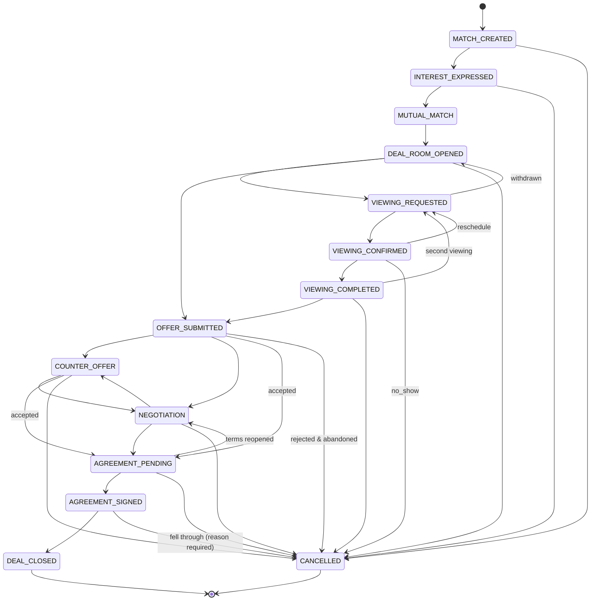

# LILITH by THE MIDDLE — Architecture Blueprint
## Part 2 — Matching, Lilith AI, Deal Machine, Messaging, Fees (Sections 9–13)

---

# 9. Matching Engine Architecture

## 9.1 Principles

1. **Deterministic.** `score = f(requirement, property, weight_profile)` — a pure function. No network calls, no randomness, no LLM. Given the same three inputs, the score is identical forever. `inputs_hash` proves it.
2. **Explainable by construction.** Reasons are produced by the same pass that produces the number, not reverse-engineered afterwards.
3. **Configurable without deploy.** Weights, thresholds and rules live in `match_weight_profiles` / `match_rules`.
4. **Two-phase.** Cheap SQL candidate generation (indexed) → in-memory precise scoring of ≤500 candidates.
5. **Symmetric.** The same engine runs demand→supply (Client/Agent discover) and supply→demand (Owner sees who is looking).

## 9.2 Pipeline

```
                 ┌─────────────────────────────────────────────┐
 trigger ───────►│ 1. CANDIDATE GENERATION  (SQL, indexed)      │
 (requirement    │    hard filters + geo + price band + status  │
  activated,     └───────────────┬─────────────────────────────┘
  property                       │ ≤500 rows
  published,     ┌───────────────▼─────────────────────────────┐
  nightly        │ 2. DISQUALIFY PASS (rules type=DISQUALIFY)   │
  rescore)       │    → drop with recorded reason               │
                 └───────────────┬─────────────────────────────┘
                 ┌───────────────▼─────────────────────────────┐
                 │ 3. DIMENSION SCORING (12 dimensions, 0..1)   │
                 └───────────────┬─────────────────────────────┘
                 ┌───────────────▼─────────────────────────────┐
                 │ 4. WEIGHTED AGGREGATION → raw 0..1           │
                 └───────────────┬─────────────────────────────┘
                 ┌───────────────▼─────────────────────────────┐
                 │ 5. MODIFIERS (freshness, verification,       │
                 │    responsiveness, quality) — bounded ±12    │
                 └───────────────┬─────────────────────────────┘
                 ┌───────────────▼─────────────────────────────┐
                 │ 6. CONFIDENCE (data completeness)            │
                 └───────────────┬─────────────────────────────┘
                 ┌───────────────▼─────────────────────────────┐
                 │ 7. REASON ASSEMBLY (matched/tradeoff/unmet)  │
                 └───────────────┬─────────────────────────────┘
                 ┌───────────────▼─────────────────────────────┐
                 │ 8. PERSIST matches + match_scores + reasons  │
                 │    emit match_generated                      │
                 └─────────────────────────────────────────────┘
                                 │
                 ┌───────────────▼─────────────────────────────┐
                 │ 9. (async, optional) Lilith writes the       │
                 │    one-paragraph match_explanation           │
                 └─────────────────────────────────────────────┘
```

## 9.3 Constraint taxonomy

| Class | Meaning | Effect | Example |
|---|---|---|---|
| **HARD** | Must be satisfied; expressed in SQL where possible | candidate excluded, no match row created | transaction type mismatch (RENT requirement vs SALE-only property); property not `PUBLISHED` |
| **DISQUALIFY** | Contextual killers, checked after generation | match row created with `status='SUPPRESSED'` + reason, never shown | property owner blocked the client; duplicate listing; property already `UNDER_OFFER` on another deal; requirement is the user's own property |
| **SOFT** | Graded 0..1 | contributes weighted score | budget fit, bedrooms, transit distance, furnishing |
| **PREFERENCE** | User-declared importance (`MUST`/`NICE`/`BONUS`) | `MUST` promotes the item to DISQUALIFY; `NICE` = normal weight; `BONUS` = ×0.4 weight and can only add | "must allow pets" |

### 9.3.1 Hard constraint list (V1)

```
H1  property.status = 'PUBLISHED' AND property.deleted_at IS NULL
H2  requirement.transaction_type maps into property.transaction_types
      BUY→SALE · RENT→RENT · RENT_TO_OWN→RENT_TO_OWN · INVEST→SALE|INVESTMENT
H3  property.property_type = ANY(requirement.property_types)
H4  price within [budget_min, budget_max × (1 + budget_flex_pct/100)]
H5  property.available_from <= requirement.move_in_to
H6  geo: ST_DWithin(property.geo_point, requirement target area, radius)
      radius = area boundary, or 3km around centroid when no boundary
H7  requirement.bedrooms_min <= property.bedrooms  (studio counted as 0)
H8  property.owner_user_id <> requirement.client_user_id
```

### 9.3.2 Disqualifying constraint list (V1)

```
D1  block list between the two parties (either direction)
D2  property.duplicate_of_property_id IS NOT NULL
D3  property has an active deal in status >= OFFER_SUBMITTED for the same unit
D4  requirement.status <> 'ACTIVE'
D5  property.quality_flags contains 'FRAUD_SUSPECTED'
D6  MUST-preference violated (e.g. pets required, property NOT_ALLOWED)
D7  same pair already has a match with a PASS decision <30 days old
```

## 9.4 Dimension scoring functions

All return `[0,1]`. Missing input → `null`, which lowers confidence and redistributes weight rather than scoring 0.

| # | Dimension | Function |
|---|---|---|
| 1 | `location` | `1.0` inside a named target area; else decay by centroid distance: `max(0, 1 − d_km / 6)` |
| 2 | `budget` | Rent: perfect when `price ≤ budget_max`. `price ≤ min` → `1.0`. Inside band → `1 − 0.3·(price−min)/(max−min)`. Over max → `max(0, 1 − 2.5·(price−max)/max)` (0 at +40%) |
| 3 | `transaction_type` | exact `1.0`; compatible (INVEST vs SALE) `0.8`; else hard-filtered |
| 4 | `property_type` | exact `1.0`; same family (condo/apartment) `0.85` |
| 5 | `bedrooms` | exact `1.0`; +1 over `0.85`; −1 under and `bedrooms_min` allows `0.5`; else `0.2` |
| 6 | `size` | inside range `1.0`; within 15% outside `0.7`; within 30% `0.4`; else `0.1` |
| 7 | `move_in` | property available inside window `1.0`; ≤14 days late `0.8`; ≤30 `0.6`; ≤60 `0.35`; else `0.1` |
| 8 | `furnishing` | exact `1.0`; `ANY` pref `1.0`; FULLY when PARTIAL wanted `0.8`; UNFURNISHED when FULLY wanted `0.2` |
| 9 | `facilities` | `Σ(matched NICE amenities)/Σ(NICE)` with BONUS amenities adding up to `+0.15` capped at `1.0` |
| 10 | `pet_policy` | required & ALLOWED `1.0`; NEGOTIABLE `0.6`; SMALL_PETS when small pet `1.0`; not required `1.0` |
| 11 | `transport` | `walk_minutes ≤ target` → `1.0`; each extra minute −`0.06`, floor `0.1`; no requirement → `null` |
| 12 | `special_requirements` | cosine similarity of `requirement.embedding` vs `property.embedding`, rescaled `(cos − 0.6)/0.35` clipped to `[0,1]`; `null` when either embedding missing |

## 9.5 Weight profile (seed, `code='default_rent_v1'`)

```jsonc
{
  "code": "default_rent_v1", "version": 1, "status": "ACTIVE",
  "scope": { "transaction_type": ["RENT", "RENT_TO_OWN"] },
  "weights": {
    "location": 0.20, "budget": 0.20, "bedrooms": 0.10, "size": 0.08,
    "move_in": 0.10, "transport": 0.10, "facilities": 0.07,
    "furnishing": 0.05, "pet_policy": 0.04, "property_type": 0.03,
    "transaction_type": 0.01, "special_requirements": 0.02
  },
  "modifiers": {
    "verified_ownership":      { "type": "add", "value":  5 },
    "agent_verified":          { "type": "add", "value":  2 },
    "freshness_days_7":        { "type": "add", "value":  3 },
    "freshness_days_over_60":  { "type": "add", "value": -4 },
    "responder_fast":          { "type": "add", "value":  3 },  // median reply < 2h
    "responder_slow":          { "type": "add", "value": -5 },  // median reply > 48h
    "media_quality_low":       { "type": "add", "value": -3 },
    "completion_below_85":     { "type": "add", "value": -2 }
  },
  "modifier_bounds": { "min": -12, "max": 12 },
  "thresholds": {
    "show_min_score": 45,
    "super_match_min": 85,
    "auto_notify_owner": 75,
    "confidence_floor": 0.35
  }
}
```

`default_sale_v1` is a sibling profile with `budget 0.24 / location 0.22 / size 0.12 / transport 0.08 / move_in 0.04`.

**Weight-change workflow:** Admin edits a `DRAFT` profile → runs *shadow scoring* over the last 2,000 matches → the diff report (score delta distribution, rank-change of top-10 per requirement) is shown → publish sets it `ACTIVE`, retires the old version, and enqueues `match.rescore.batch`. Old `match_scores` rows are preserved, so before/after is always reconstructable.

## 9.6 Aggregation, modifiers, confidence

```ts
// packages/core/matching/score.ts  — pure, no I/O
export function scoreMatch(req: NormalizedRequirement, prop: NormalizedProperty, profile: WeightProfile): MatchScoreResult {
  const dims = computeDimensions(req, prop);                     // Record<Dim, number|null>
  const present = Object.entries(profile.weights).filter(([d]) => dims[d] !== null);
  const totalWeight = present.reduce((s, [, w]) => s + w, 0);    // redistribute missing dims
  const base = present.reduce((s, [d, w]) => s + w * dims[d]!, 0) / totalWeight; // 0..1

  const rawModifier = applyModifiers(prop, req, profile.modifiers);
  const modifier = clamp(rawModifier, profile.modifier_bounds.min, profile.modifier_bounds.max);

  const score = clamp(Math.round(base * 100 + modifier), 0, 100);

  // confidence = how much of the decision rests on data we actually have
  const dataCoverage = totalWeight;                              // 0..1 of weight satisfied
  const freshness   = freshnessFactor(prop.last_verified_at);    // 1.0 → 0.6
  const verification= prop.ownership_verified ? 1.0 : 0.85;
  const confidence  = round3(dataCoverage * freshness * verification);

  return { score, confidence, dimensions: dims, modifier,
           inputs_hash: sha256(canonicalJson({ req: req.scoringView, prop: prop.scoringView, profile: profile.id })) };
}
```

**Interpretation bands (shown in UI):**

| Score | Label TH | Label EN | UI |
|---|---|---|---|
| 85–100 | ตรงมาก | Exceptional | champagne ring, eligible for Super Match |
| 70–84 | ตรงดี | Strong | solid ring |
| 55–69 | พอไปได้ | Fair | outline ring |
| 45–54 | ต้องประนีประนอม | Compromise | grey ring + tradeoffs shown first |
| <45 | not shown | | suppressed |

Confidence `<0.35` → the card shows a "ข้อมูลไม่ครบ" chip and the property is deprioritised, never silently boosted.

## 9.7 Reason assembly output contract

```jsonc
{
  "match_id": "…",
  "score": 87,
  "confidence": 0.82,
  "weight_profile": "default_rent_v1@1",
  "matched_constraints": [
    { "dimension": "location", "code": "IN_TARGET_AREA", "score": 1.0,
      "text_th": "อยู่ในย่านทองหล่อที่ระบุไว้", "text_en": "Inside your Thong Lo target area" },
    { "dimension": "transport", "code": "WALK_UNDER_TARGET", "score": 1.0,
      "params": { "station": "BTS Thong Lo", "walk_minutes": 4 },
      "text_th": "เดิน 4 นาทีถึง BTS ทองหล่อ", "text_en": "4 min walk to BTS Thong Lo" }
  ],
  "tradeoffs": [
    { "dimension": "budget", "code": "OVER_BUDGET_WITHIN_FLEX", "score": 0.72,
      "params": { "over_amount": 500000, "over_pct": 5.2 },
      "text_th": "สูงกว่างบ 5,000 บาท/เดือน (อยู่ในช่วงยืดหยุ่นที่ตั้งไว้)",
      "text_en": "฿5,000/mo over budget — within your 10% flexibility" }
  ],
  "unmatched_constraints": [
    { "dimension": "furnishing", "code": "PARTIAL_NOT_FULL", "score": 0.2,
      "text_th": "ตกแต่งบางส่วน ไม่ใช่ Fully Furnished ตามที่ต้องการ",
      "text_en": "Partially furnished, you asked for fully furnished" }
  ],
  "match_explanation": {
    "text_th": "ยูนิตนี้ตรงกับสิ่งที่คุณให้ความสำคัญที่สุด…",
    "source": "AI", "model": "gpt-4.1-mini", "prompt_version": "explain_match@3",
    "confidence": 0.9, "generated_at": "2026-09-07T10:22:31Z", "ai_run_id": "…"
  }
}
```

Note the split: `matched/tradeoffs/unmatched` are **deterministic**; only `match_explanation` is AI, and it is clearly attributed. If the AI call fails, the UI renders the template summary instead — never an error.

## 9.8 Candidate generation SQL (shape)

```sql
WITH r AS (SELECT * FROM requirements WHERE id = $1)
SELECT p.id
FROM properties p, r
WHERE p.status = 'PUBLISHED' AND p.deleted_at IS NULL
  AND p.property_type = ANY(r.property_types)
  AND (CASE r.transaction_type
        WHEN 'RENT' THEN 'RENT'  = ANY(p.transaction_types)
        WHEN 'BUY'  THEN 'SALE'  = ANY(p.transaction_types)
        WHEN 'RENT_TO_OWN' THEN 'RENT_TO_OWN' = ANY(p.transaction_types)
        ELSE TRUE END)
  AND (CASE r.transaction_type
        WHEN 'RENT' THEN p.price_rent_monthly_amount
                          BETWEEN r.budget_min_amount
                              AND (r.budget_max_amount * (100 + r.budget_flex_pct) / 100)
        ELSE p.price_sale_amount
                          BETWEEN r.budget_min_amount
                              AND (r.budget_max_amount * (100 + r.budget_flex_pct) / 100) END)
  AND p.bedrooms >= r.bedrooms_min
  AND p.available_from <= r.move_in_to
  AND ST_DWithin(p.geo_point, (SELECT ST_Union(centroid) FROM locations WHERE id = ANY(r.location_ids)), 3000)
  AND p.owner_user_id <> COALESCE(r.client_user_id, '00000000-0000-0000-0000-000000000000')
ORDER BY p.published_at DESC
LIMIT 500;
```

Performance target: ≤80ms p95 at 100k published properties. Verified by a seeded benchmark in CI (`pnpm bench:match`).

## 9.9 Feed ordering (screen 19)

`ORDER BY` is not raw score — it is a serving policy, itself configurable:

```
rank = score
     − 8  if the same project already appeared twice in this session   (diversity)
     + 4  if property published < 48h                                  (freshness boost)
     − 15 if this owner has 3+ unanswered interests in 7 days          (protect demand-side experience)
     + 6  if the counterparty already expressed interest in this pair  (near-mutual, close the loop)
```

Deck is generated server-side, cached 90s per `(requirement_id, cursor)`, and invalidated on any interest action.

## 9.10 Where Lilith is *not* allowed

- Cannot alter `score`, `confidence`, dimension values or reason lists.
- Cannot change a match's `status`.
- Cannot decide disqualification.
- May: extract structure, normalise values, produce embeddings, write the summary paragraph, flag suspected duplicates **for human/rule confirmation**, and rank *ties* within an already-scored set at V2 only behind a feature flag with an A/B measurement.

---

# 10. Lilith AI Architecture

## 10.1 Service boundary

Lilith is a **library + HTTP surface**, never a UI concept in code:

```
packages/ai/
  client.ts          LilithClient interface — provider-agnostic
  providers/openai.ts, providers/mock.ts
  tasks/
    extract-property.ts
    extract-requirement.ts
    normalize.ts
    explain-match.ts
    deal-summary.ts
    detect-duplicate.ts
  guard/
    redact.ts        PII stripping before egress
    schema.ts        zod validation of model output
    budget.ts        per-user / per-org cost ceilings
  runs.ts            ai_runs persistence + metrics
```

Routes (thin wrappers, all `POST`, all authenticated, all rate-limited):

```
POST /api/ai/extract-property
POST /api/ai/extract-requirement
POST /api/ai/normalize
POST /api/ai/explain-match
POST /api/ai/deal-summary
POST /api/ai/detect-duplicate
POST /api/ai/property-review      (composite: extract + normalize + duplicate + quality)
POST /api/ai/requirement-summary  (composite: extract + normalize + summary)
```

## 10.2 Universal task contract

Every task, without exception:

```ts
interface LilithTask<TIn, TOut> {
  code: string;                    // 'extract_property'
  inputSchema: ZodType<TIn>;
  outputSchema: ZodType<TOut>;     // model must satisfy this or the run is REJECTED_SCHEMA
  promptVersion: string;           // resolved from prompt_versions at call time
  model: string;                   // resolved, recorded
  timeoutMs: number;               // hard ceiling
  retries: { max: number; backoffMs: number };
  fallback: (input: TIn) => TOut | null;   // deterministic degradation
  redact: (input: TIn) => TIn;             // strip PII before egress
  costCeilingMicroUsd: number;
}
```

Every response envelope:

```jsonc
{
  "data": { /* task-specific, schema-validated */ },
  "meta": {
    "ai_run_id": "…", "task": "extract_property", "model": "gpt-4.1-mini",
    "prompt_version": "extract_property@4", "confidence": 0.86,
    "input_ref": { "property_id": "…", "input_hash": "sha256:…" },
    "generated_at": "2026-09-07T10:22:31Z",
    "status": "OK", "latency_ms": 1840, "cost_micro_usd": 2100,
    "human_override": null
  }
}
```

**Rule:** any UI element rendering `data` must render a provenance affordance (confidence badge + "แก้ไข" override). A component that displays AI output without `meta` fails code review.

## 10.3 Task specifications

### T1 `extract_property`
- **In:** free text description (th/en), optional OCR of a brochure, existing structured fields.
- **Out:** `{ property_type, bedrooms, bathrooms, size_sqm, floor, furnishing, amenity_codes[], pet_policy, available_from, price_hints{}, project_name, red_flags[] }` each with `field_confidence`.
- **Fallback:** regex/keyword extractor for bedrooms, size, price, project name (deterministic, ~60% coverage).
- **Human override:** the wizard pre-fills fields but the user must confirm; `ai_runs.human_decision` records ACCEPTED/EDITED/REJECTED per field. This label set is the training/eval data for prompt v-next.

### T2 `extract_requirement`
- **In:** free text ("หาคอนโด 2 ห้องนอน แถวอโศก งบ 45k เข้าอยู่ ต.ค. มีสัตว์เลี้ยง 1 ตัว").
- **Out:** structured requirement fields + `preferences[] {key, value, importance}` + `ambiguities[]` (questions to ask the user).
- **Fallback:** null → the wizard simply stays manual.

### T3 `normalize`
- Purpose: canonicalise project names, addresses, amenity synonyms ("ฟิตเนส"/"gym"/"fitness" → `AMENITY_GYM`), unit sizes, Thai/English location spellings.
- **Deterministic first:** a dictionary/alias table is consulted before the model; the model only handles misses, and every accepted normalisation is written back into the alias table (with `source='AI'` + review flag), so the system gets cheaper and more deterministic over time.

### T4 `explain_match`
- **In:** the deterministic reason arrays + non-identifying property/requirement facts.
- **Out:** `{ text_th, text_en }` ≤60 words each, must reference only supplied facts.
- **Guard:** post-check rejects output containing a number not present in the input (cheap numeric-token containment test). Rejection → template fallback.

### T5 `deal_summary`
- **In:** deal state, timeline events, offers, viewing outcomes, last N messages (redacted).
- **Out:** `{ summary, open_items[], suggested_next_actions[], risks[] }`.
- **Guard:** never proposes a legal/price commitment; suggested actions are drawn from a closed vocabulary of platform actions (`REQUEST_VIEWING`, `SEND_COUNTER`, `ASK_FOR_DOCUMENT`, …) so the UI can render them as real buttons.

### T6 `detect_duplicate`
- **Deterministic pre-filter:** same `project_location_id` + same `unit_number` (exact) → duplicate, no AI involved. Then perceptual image hashing (pHash) on cover photos; then trigram similarity on title/description; then embedding cosine.
- **AI role:** adjudicate only the ambiguous band (`0.75 ≤ similarity < 0.92`) and return `{is_duplicate, confidence, evidence[]}`.
- **Action:** `confidence ≥ 0.9` → auto-flag + `moderation_queue`. Below → queue only. **Never auto-deletes a listing.**

## 10.4 Guardrails

| Guardrail | Implementation |
|---|---|
| PII egress | `redact()` replaces phone, email, LINE ID, national ID, exact unit number, personal names with typed tokens (`<PHONE_1>`); the mapping stays in-process and is re-substituted after the call only for the requesting user |
| Schema enforcement | zod parse; failure → one repair retry with the validation error appended; second failure → `REJECTED_SCHEMA` + fallback |
| Timeout | 8s interactive, 30s batch; on timeout the run is recorded and the fallback returns |
| Cost | per-user daily ceiling and per-org monthly ceiling in `budget.ts`; exceeded → `429` with `code=AI_BUDGET_EXCEEDED`, features degrade to deterministic |
| Prompt injection | property descriptions are untrusted input — wrapped in delimiters, and the system prompt states that content inside them is data. Output is schema-constrained, so injected instructions cannot become actions |
| Hallucinated numbers | numeric containment check (T4), and any AI-suggested price is labelled `estimate`, never written to a price column |
| Model change | `model` and `prompt_version` are recorded per run; changing either requires a new `prompt_versions` row and a shadow-eval report |
| Human override | every AI-populated field carries `source: 'AI'|'HUMAN'`; a human edit flips it to `HUMAN` permanently and is audited |
| Kill switch | `AI_ENABLED=false` env → all tasks return fallbacks; the product must remain fully usable with AI off. **This is a release criterion.** |

## 10.5 Evaluation

- Golden set: 200 Thai property descriptions + 200 requirement texts with hand-labelled ground truth, in `packages/ai/evals/`.
- `pnpm ai:eval` scores field-level precision/recall per prompt version and writes a report; a prompt version cannot be set `ACTIVE` if it regresses any field's F1 by more than 2 points.
- Live monitoring: weekly rollup of `human_decision` distribution per task; `REJECTED` rate above 15% opens a review ticket automatically.

---

# 11. Deal State Machine

## 11.1 States



## 11.2 Transition table (the implementable spec)

Legend: **Actor** = who may fire it · **Guard** = server-side precondition · **Data** = required payload · **Events** = domain events emitted.

| # | From → To | Actor | Guard | Required data | Events emitted | Audit |
|---|---|---|---|---|---|---|
| 1 | *(none)* → `MATCH_CREATED` | SYSTEM (job) | score ≥ `show_min_score` | match_id | `match.generated` | system |
| 2 | `MATCH_CREATED` → `INTEREST_EXPRESSED` | CLIENT / AGENT / OWNER (one side) | is match participant; not already decided; quota ok | `{side, action:'INTERESTED'|'SUPER'}` | `interest.expressed` (+`match.super_used`) | actor |
| 3 | `INTEREST_EXPRESSED` → `MUTUAL_MATCH` | SYSTEM | both sides `INTERESTED` | — | `match.mutual` | system |
| 4 | `MUTUAL_MATCH` → `DEAL_ROOM_OPENED` | SYSTEM (auto) or either party | both parties tier ≥ T2; property still `PUBLISHED` | — | `deal_room.opened`, `contact.disclosed` | system + both parties recorded as participants |
| 5 | `DEAL_ROOM_OPENED` → `VIEWING_REQUESTED` | any participant | room `OPEN` | `{slots[≥1], attendees, note?}` | `viewing.requested` | actor |
| 6 | `VIEWING_REQUESTED` → `VIEWING_CONFIRMED` | **counterparty only** (not the requester) | slot still free; ≥2h in future | `{selected_slot_id, location_note}` | `viewing.confirmed`, `notification.scheduled` | actor |
| 7 | `VIEWING_CONFIRMED` → `VIEWING_COMPLETED` | either participant, after `scheduled_at` | now ≥ scheduled_at | `{outcome, feedback?}` | `viewing.completed` | actor |
| 8 | `VIEWING_CONFIRMED` → `VIEWING_REQUESTED` | any participant | >2h before start | `{reason, new_slots[]}` | `viewing.rescheduled` | actor |
| 9 | `VIEWING_CONFIRMED` → `CANCELLED` | any participant / SYSTEM | no-show recorded after +2h | `{reason}` | `viewing.no_show`, `deal.cancelled` | actor/system |
| 10 | `DEAL_ROOM_OPENED` \| `VIEWING_COMPLETED` → `OFFER_SUBMITTED` | demand side (or agent with `can_negotiate`) | no live offer pending from same side | `{amount, currency, terms, expires_at}` | `offer.submitted` | actor |
| 11 | `OFFER_SUBMITTED` → `COUNTER_OFFER` | opposite side | offer not expired/withdrawn | `{amount, terms, parent_offer_id}` | `offer.countered` | actor |
| 12 | `COUNTER_OFFER` ↔ `NEGOTIATION` | either side | rounds < 20 | `{message?}` | `negotiation.round` | actor |
| 13 | `OFFER_SUBMITTED` \| `COUNTER_OFFER` → `AGREEMENT_PENDING` | receiving side | offer live; actor has `can_negotiate` | `{offer_id, accept:true}` | `offer.accepted`, `agreement.required` | actor |
| 14 | `AGREEMENT_PENDING` → `AGREEMENT_SIGNED` | all signing parties | every required party signed | `{document_id, signature_evidence[]}` | `agreement.signed` | each signer |
| 15 | `AGREEMENT_SIGNED` → `DEAL_CLOSED` | **dual confirmation**: supply side AND demand side, or ADMIN | `agreed_value_amount` present; both confirmations within 30 days | `{transaction_value_amount, closed_at, evidence_document_id?}` | `deal.closed` → triggers `fee.generate` | both actors + system |
| 16 | any non-terminal → `CANCELLED` | any participant or ADMIN | reason required (enum + free text) | `{reason_code, reason_text}` | `deal.cancelled` | actor |
| 17 | `DEAL_CLOSED` → *(terminal)* | — | immutable | — | — | — |

**Enforcement rules**

- A single function owns all of it:
  ```ts
  transition(ctx: ActorContext, dealId: string, to: DealStatus, payload: unknown): Promise<Result<Deal, DomainError>>
  ```
  It (a) loads the deal `FOR UPDATE`, (b) looks up `(from,to)` in a static `TRANSITIONS` table, (c) checks actor role via `deal_participants`, (d) validates payload with the transition's zod schema, (e) runs the guard, (f) writes `deals`, `deal_transitions`, `outbox`, `audit_logs` in one transaction.
- `deals.status` has **no other writer**. A Postgres trigger raises if `status` changes without a matching `deal_transitions` row in the same transaction.
- Every transition is idempotent on `Idempotency-Key`.
- `CANCELLED` after `AGREEMENT_SIGNED` requires an admin acknowledgement, because a fee may already exist.

## 11.3 Timers and automatic transitions

| Timer | Rule |
|---|---|
| Match expiry | `MATCH_CREATED` untouched for 30 days → `EXPIRED` |
| Interest expiry | one-sided interest with no counterparty response in 14 days → notify, then expire at 21 days |
| Offer expiry | `offers.expires_at` reached → `status='EXPIRED'`, deal returns to `NEGOTIATION` |
| Viewing no-show | +2h after `scheduled_at` with no completion → prompt both parties, auto `NO_SHOW` at +24h |
| Deal dormancy | no activity 45 days → `dormant` flag + nudge; 90 days → `CANCELLED(reason=DORMANT)` |
| Close confirmation | first close confirmation waits 30 days for the second; otherwise reverts with a support ticket |

---

# 12. Messaging + Notification Architecture

## 12.1 Messaging

- **Scope:** messaging exists only inside a Deal Room. There is no platform-wide DM — this removes an entire class of harassment and disintermediation risk.
- **Authorization:** every read/write checks `deal_participants` for the requesting user, on every request, server-side.
- **Transport:** `POST /api/deals/:id/messages` for send; delivery via SSE stream `/api/deals/:id/stream` (Postgres `LISTEN/NOTIFY` → per-connection fan-out). Polling fallback with `?since=`.
- **Ordering:** server-assigned `created_at` + monotonic `seq BIGINT` per room; clients sort by `seq`.
- **System messages:** every state transition writes a `type='SYSTEM'` message so the conversation and the timeline are the same story.
- **Attachments:** upload → `documents` (private) → message references `document_id`; recipients get signed URLs valid 15 minutes, each issuance audited.
- **Anti-disintermediation:** an outbound-contact detector (regex for Thai/int'l phone patterns, LINE IDs, emails, and common obfuscations) runs on send. Policy is configurable per stage:
  - before `VIEWING_CONFIRMED`: contact strings are masked and a notice is shown ("แลกเปลี่ยนเบอร์ได้หลังยืนยันนัดชม");
  - after: allowed, but the message is flagged for pattern analysis. This is a business-model protection and must be explained in the Terms.
- **Retention/redaction:** admin can redact a message (`redacted=true`, body moved to an admin-only column) — never hard-delete inside a live deal.

## 12.2 Notifications

Channels: `IN_APP` (always), `PUSH` (Web Push), `EMAIL` (Resend), `SMS` (transactional only — OTP and viewing reminders, because SMS costs money).

Routing matrix (defaults; user-overridable except the "always" rows):

| Notification type | In-app | Push | Email | SMS |
|---|---|---|---|---|
| `otp_code` | — | — | ✅ (email flow) | ✅ always |
| `match.mutual` ("It's a Match") | ✅ | ✅ | digest | — |
| `interest.received` | ✅ | ✅ | digest | — |
| `deal_room.opened` | ✅ | ✅ | ✅ | — |
| `message.received` | ✅ | ✅ (3-min debounce per room) | if unread 30 min | — |
| `viewing.requested` | ✅ | ✅ | ✅ | — |
| `viewing.confirmed` | ✅ | ✅ | ✅ + .ics | ✅ |
| `viewing.reminder` (T−3h) | ✅ | ✅ | — | ✅ |
| `offer.submitted` / `offer.accepted` | ✅ | ✅ | ✅ | — |
| `agreement.signed` | ✅ | ✅ | ✅ | — |
| `deal.closed`, `fee.issued` | ✅ | ✅ | ✅ always | — |
| `verification.decided` | ✅ | ✅ | ✅ | — |
| `opportunity.digest` (screen 37) | ✅ | opt-in | weekly | — |

Mechanics:
- Producer = outbox consumer, so a notification can never exist for an event that did not commit.
- `dedupe_key` per `(user, type, subject_id, window)` prevents storms; message notifications debounce 3 minutes per room.
- Quiet hours default 22:00–08:00 ICT: `HIGH` priority (viewing confirmed, offer) still delivers; everything else queues to morning.
- `delivery_log` records provider ids and failures; a failed push does not retry more than twice (token likely dead → prune).
- Every notification has a `deep_link` that resolves to one of the 38 screens, and unauthenticated deep links route through login and return.

---

# 13. Success Fee Architecture

## 13.1 Model

The fee engine is a **rule evaluation + immutable snapshot** system. Nothing about "0.1%" is hardcoded anywhere in application code; it exists as one row in `fee_rules`.

```
deal.closed  ──►  FeeEngine.compute(deal)
                    1. select applicable fee_rule (scope match + effective date)
                    2. resolve fee_basis_amount from the rule's basis
                    3. fee_amount = round_half_up(basis * rate_bp / 10000)
                    4. apply min / max clamps
                    5. compute VAT
                    6. resolve payer(s) from rule.payer / payer_split
                    7. persist fees row + FULL rule snapshot (JSONB)
                    8. emit fee.generated  ──► invoice job
```

## 13.2 Basis definitions (configurable, seeded)

| `basis` | `fee_basis_amount` | Typical use |
|---|---|---|
| `TRANSACTION_VALUE` | `deals.agreed_value_amount` | sale, rent-to-own strike |
| `ANNUAL_RENT` | `monthly_rent × min(lease_months, 12)` | long lease |
| `MONTHLY_RENT` | `monthly_rent × n` (n in rule params) | short lease |
| `FIXED` | ignored; `fixed_amount` used | flat service fee |

**Seed rule (V1):**

```jsonc
{
  "code": "middle_success_fee",
  "version": 1,
  "status": "ACTIVE",
  "applies_to": { "transaction_type": ["SALE","RENT","RENT_TO_OWN","INVEST"] },
  "basis": "TRANSACTION_VALUE",
  "rate_bp": 10,                  // 10 basis points = 0.1%
  "min_amount": 0,
  "max_amount": null,
  "payer": "OWNER",
  "vat_rate_bp": 700,             // 7% Thai VAT
  "effective_from": "2026-01-01"
}
```

Changing the pricing model later = insert `version: 2` with a new `effective_from`. Existing `fees` rows are untouched because they carry `fee_rule_snapshot`. **Historic invoices can always be re-derived and defended.**

## 13.3 Worked example

Sale closed at ฿12,500,000 → stored as `1_250_000_000_00` satang.

```
fee_basis_amount = 1,250,000,000,00 satang
fee_amount       = 1,250,000,000,00 × 10 / 10,000 = 1,250,000,00 satang = ฿12,500
vat_amount       = 12,500 × 7%                     = ฿875
total_amount                                        = ฿13,375
payer            = OWNER (per rule)
```

Rounding: half-up at satang precision, applied once, at step 3. All arithmetic in `BigInt`. A property-based test asserts `sum(splits) == fee_amount` for every split configuration.

## 13.4 Lifecycle and states

```
fees:      DRAFT ──► ISSUED ──► (WAIVED | VOID)
invoices:  ISSUED ──► PARTIALLY_PAID ──► PAID
                  └─► OVERDUE ──► (PAID | CANCELLED)
payments:  PENDING ──► CONFIRMED | FAILED | REFUNDED
receipts:  issued on first CONFIRMED payment covering the invoice
```

- MVP payment flow is **manual/off-platform**: PromptPay QR + bank transfer; the payer uploads slip evidence; an operator confirms → `payments.status='CONFIRMED'` (audited, dual-control for amounts over a threshold). V1 adds Omise/2C2P webhooks; the state machine is unchanged, only the confirmation actor becomes the provider webhook.
- **Evidence chain:** `deals.agreed_value_amount` must be supported by at least one of: signed agreement document, uploaded contract, or dual party confirmation with amounts entered independently by both sides. If the two sides enter different values, the deal cannot close — it goes to `moderation_queue` as a `FEE_DISPUTE`.
- **Waiver / override:** admin-only, requires `override_reason`, writes `audit_logs` with before/after, and never edits an issued invoice — it voids and reissues with a linked credit note.
- **Reconciliation:** a nightly job asserts `Σ issued invoices == Σ fees(ISSUED)` and `Σ confirmed payments == Σ paid invoices`; any drift raises an operator alert. This report is what protects the business from silent revenue leakage.

## 13.5 Invoice numbering

`MP-INV-{YYYY}-{000001}` from a Postgres sequence per year, gapless (allocated inside the issuing transaction). Receipts use `MP-RCP-{YYYY}-{000001}`. Thai tax invoice fields (`issued_to.tax_id`, branch, address) are snapshotted at issue time, not joined live, because the customer's registered details may change.
